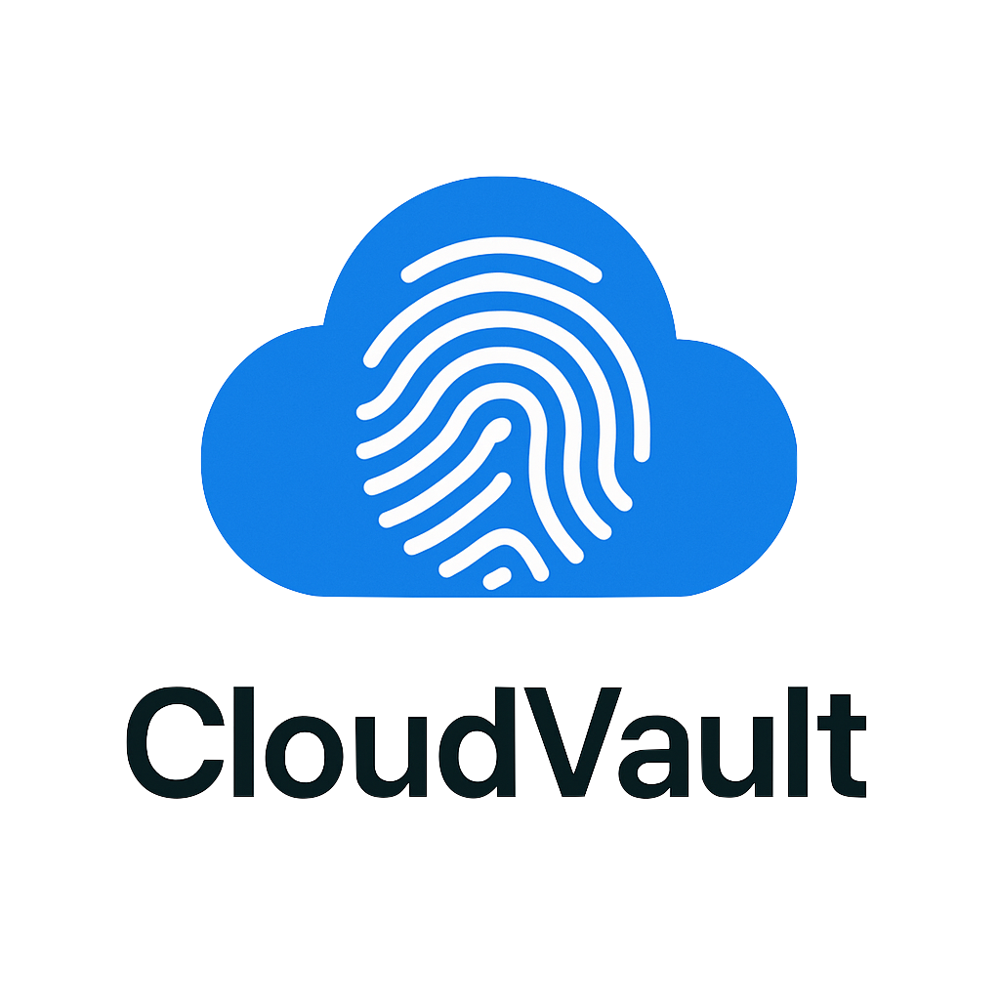

# Cloud Vault Password Manager

<p align="center">
  
</p>

Cloud Vault is a **private open-source password manager** designed to be deployed on your own cloud (currently AWS-supported). It helps you store personal and shared passwords securely, while offering a modern passwordless login experience using Passkey authentication.

---

## 🎯 Purpose

Cloud Vault’s goal is to give people full control over their password manager by letting them run it in their own infrastructure. Unlike SaaS solutions where you give up trust to a third-party, **Cloud Vault** can be deployed anywhere on your private cloud or public cloud services (currently AWS is supported by default).

It supports:

- Personal passwords (encrypted in transit and at rest).
- Group/shared passwords you can securely share with family members or colleagues.
- Passwordless login with Passkey, so you don’t need to remember a master password. Your device’s biometric authentication (Face ID, fingerprint) unlocks your vault.

---

## 💡 Reason

This project was built for people who often get asked to keep passwords for others (e.g. family members) as well as for themselves. With Cloud Vault, you can:

- Store your personal passwords securely.
- Share selected passwords with other users in groups.
- Forget about master passwords entirely thanks to Passkey support.

---

## ⚠️ Disclaimer ❗❗

> **This is a personal project built for fun and learning. It is not tested for production use and is not guaranteed to be secure.**  
> **If you visit the demo page, please do not store any real passwords.**

---

## 🌐 Demo

You can try a demo of the app here:

➡️ [Demo Link](#replace-with-your-link) COMING SOON!

To register:

1. Provide your email.
2. Register using a device with Passkey support (Apple Face ID, Android fingerprint, etc.).
3. **If you don’t have a device with Passkey**, or don’t want to register one, you can use a browser extension as explained in this guide:

➡️ [Chrome Webauthn Emulator](https://developer.chrome.com/docs/devtools/webauthn)

---

## 📦 How to Use

### ✅ Prerequisites

- AWS account
- AWS CLI
- Terraform
- Node.js
- npm

### 🚀 Deployment **Please note: You may be charged a fee on AWS account**

- Clone the repo.
- Deploy the infrastructure to AWS:
  - Create a file called `prod.tfvars` using the same template as `reference.tfvars`
  - Build the backend:
    ```bash
    npm install
    npm run build
    ```
  - Deploy with Terraform:
    ```bash
    cd terraform
    terraform init
    terraform apply -var-file=prod.tfvars
    ```
- Deploy the frontend: follow the instructions in [this repo](https://github.com/vito-filo/cloudvault-frontend)

---

## 🛠️ Technologies


- **NestJS** – for a scalable and modular API.
- **WebAuthn** – for Passkey authentication.
- **AWS services** – RDS, Lambda, S3, CloudFront, API Gateway, SES.

---

## 🤝 Contributing

Contributions welcome! Feel free to open issues or submit PRs.

---

## 📜 License

This project is licensed under the MIT License – see the [LICENSE](./LICENSE).
